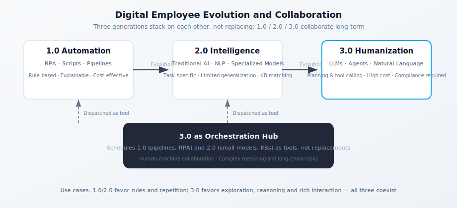
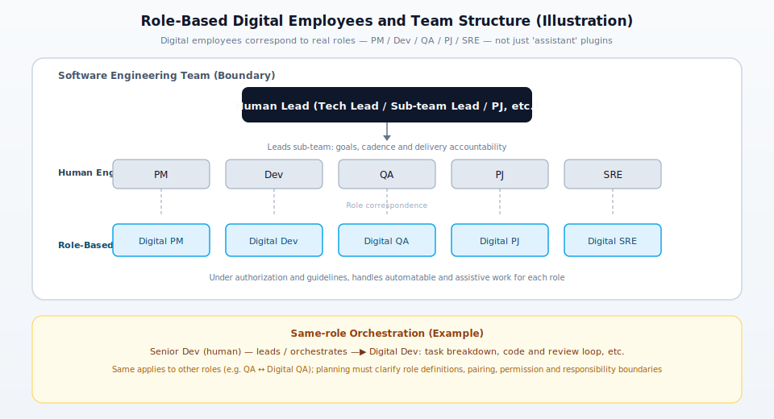
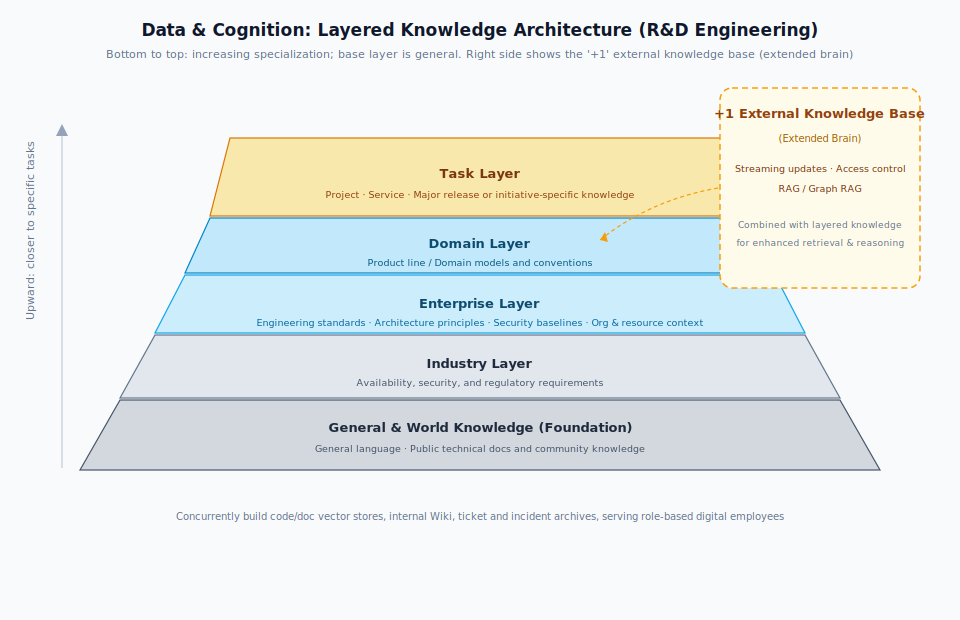

# Digital Employee: Concept, Evolution, and Implementation Essentials

---

## I. Concept: What Is a Digital Employee?

A **digital employee** is a form of "virtual workforce" — software and intelligent systems that take over work tasks originally performed by humans, or that assist humans in performing them. The underlying technology has progressed from process automation to traditional AI, and further to large language models (LLMs) and autonomous agents; the value proposition has shifted from "improving efficiency" to "human-AI collaboration that reshapes engineering workflows."

For **R&D engineering teams**, digital employees span the automatable and assistable stages across the full software engineering lifecycle — from requirements clarification and technical design review, to coding and refactoring, testing and quality assurance, build/release/operations, documentation and knowledge management, and ticket or on-call summarization.

---

## II. Evolution: From Automation to Human-Like Collaboration (1.0 → 3.0)

The industry commonly divides digital employees into three generations. These generations do not supersede one another — they coexist and are deployed in complementary tiers.

*Figure: The upper half traces the progression from 1.0 to 3.0; the lower dark block shows 3.0 acting as the orchestration hub, calling upon 1.0 and 2.0 capabilities as tools.*

### 2.1 Digital Employee 1.0: Automation

- **Characteristics**: Represented by RPA, scripts, and CI pipelines — executing well-defined, highly repetitive tasks by following established rules.
- **Typical scenarios (R&D engineering)**: Scheduled builds and health checks, environment validation, log retrieval and report generation, cross-system ticket status sync, compliance scan scheduling, and automated release checklist execution.
- **Strengths and limitations**: Highly interpretable with predictable compute costs; brittle when faced with edge cases outside its rule set and unable to handle complex judgment calls.

### 2.2 Digital Employee 2.0: Intelligent (Traditional AI)

- **Characteristics**: Layers NLP, traditional machine learning, and basic vision on top of automation, targeting specialized intelligence for **specific engineering tasks**.
- **Typical scenarios (R&D engineering)**: Knowledge-base-powered internal FAQs, simple intent routing, defect classification and triage, log pattern clustering, code snippet recommendations (pre-LLM era), and static-rule-based review hints.
- **Limitations**: Limited generalization; largely dependent on scripts and knowledge-base matching; template-bound and inflexible; poor support for complex, multi-step tasks.

### 2.3 Digital Employee 3.0: Human-Like (LLM + Agents)

- **Characteristics**: Built on LLMs and agent frameworks, with stronger capabilities for perception, memory, planning, tool use, and collaboration. Can understand goals through **natural language**, break down tasks, and invoke CI systems, APIs, retrieval pipelines, IDEs, and other tools — handling work that is less structured and professionally more demanding.
- **Typical scenarios (R&D engineering)**: Drafting requirements and technical proposals, generating code and unit tests, fault localization guidance, conversational queries and ops orchestration across multiple repositories and systems, design document assistance, and organizational knowledge Q&A with SOP guidance.
- **Strengths and limitations**: Strong general problem-solving ability with a high performance ceiling; carries additional requirements around interpretability, cost control, and compliance.

### 2.4 How the Three Generations Coexist

- **1.0 / 2.0**: Best suited to well-defined, highly repetitive scenarios where interpretability and stability matter most; cost-effective at scale.
- **3.0**: The right fit for exploratory, complex-reasoning, and high-interaction scenarios. Should serve as the **orchestration hub** — calling on existing 1.0/2.0 capabilities (pipelines, specialized models, scripts) as tools — rather than duplicating what already exists.

---

## III. Application Trends: From Point Capabilities to Process Transformation

### 3.1 From Narrow Point Solutions to Deep Integration

Traditional AI performs well on structured data but struggles with long documents, multi-repository context, and loosely structured engineering information — confining digital employees largely to narrow point-tool roles.

Generative LLMs have expanded language understanding and reasoning, enabling digital employees to engage more deeply with the **knowledge-intensive** work in R&D engineering: aligning requirements and constraints across documents, complex system design and coding, change impact analysis, recommending testing strategies, assisting with release and rollback decisions, and drafting on-call handoffs and incident retrospective writeups.

### 3.2 From "+AI" to "AI+"

- **+AI**: Embeds AI capabilities into the existing R&D toolchain, where AI mostly serves as an ancillary module and the underlying workflow structure remains unchanged.
- **AI+**: Makes intelligent interaction and agent orchestration the **center of gravity**, connecting fragmented systems (requirements, code, pipelines, monitoring, tickets) through natural language — reshaping how engineering teams collaborate. Engineers work with **role-based digital employees** to query, build, execute, and consult, all within a unified interaction layer.

In R&D engineering teams, "AI+" typically combines **multi-role digital employee collaboration, and low-code assembly**, enabling digital employees to participate as **workforce members with defined roles**, not just isolated tools.

### 3.3 Role-Based Digital Employees and Team Structure

Treating digital employees solely as tool-type helpers — code assistants, documentation assistants — is a limited view. A more organizationally grounded approach is to **map digital employees one-to-one with real engineering roles**. Just as a team has **human engineers** such as PM, Dev, QA, PJ (Project Manager), and SRE, it can also have **Digital PM, Digital Dev, Digital QA, Digital PJ, and Digital SRE** — each bearing analogous responsibilities. These are not generic "plugins" but **virtual roles with clearly defined identities, capability boundaries, and areas of responsibility** (even though the underlying implementation still consists of models, agents, and tool chains).

*Figure: Human roles map one-to-one to role-based digital employees within an R&D team; a human lead oversees the entire team. The lower section shows examples of same-role orchestration, consistent with the two "team structure" points and planning considerations in the main text.*

**Team structure** can be understood as follows:

- In a **software R&D team**, two types of workforce coexist: human engineers and **digital employees matched to their respective role types** (e.g., Digital Dev alongside Dev, Digital QA alongside QA, Digital SRE alongside SRE).
- In terms of **how work is organized**, a human engineer (typically a Tech Lead, team manager, or project manager) **leads** a sub-team made up of both human engineers and the digital employees corresponding to those roles. The human lead is accountable for goals and deliverables; digital employees handle the automatable and assistable work within their role scope under that lead's authorization and standards. **Human engineers** also **direct and orchestrate** digital employees in the same function (e.g., a senior Dev working with Digital Dev on task decomposition and closing the code review loop).

---

## IV. Key Challenges (Governance and Security)

### 4.1 Governance: Identity and Institutional Maturity

Digital employees are fundamentally programs and model services; **emotion and personality** are product-design choices for humanizing the experience. In engineering contexts, teams need to separately design for **accountability** (who signs off on code and changes), **permission models** (read-only guardrails on repositories and production), **change and retirement procedures**, and **iteration governance** — with clear delineation from human responsibilities.

Common gaps include:

1. **Distinct identity**: Beyond a name and avatar — whether unique identifiers, purpose descriptions, permission lifecycles, and role boundaries have actually been formalized at both the policy and systems level.
2. **Governance hierarchy**: Establishing clear boundaries between **role-based digital employees** and purely tool-type aids (e.g., embedded IDE completions, point plugins), one-off scripts, or general-purpose agents; building a shared vocabulary and tiered classification (organization-wide, team-specific, personal/experimental, etc.).
3. **Evaluation framework**: Moving beyond "hours of manual work replaced" to a comprehensive view of **quality, effectiveness, risk, and cost** — suited to the knowledge-intensive nature of R&D work.

### 4.2 Security: Risk Across the Full Lifecycle

R&D engineering involves source code, configurations, credentials, production data, and internal systems — all subject to strict requirements around stability, data security, and compliance. Key areas to address:

1. **Data privacy and access control**: Masking sensitive data in training and application contexts, enforcing least-privilege access, maintaining access audit trails, encryption, and isolation. Code and credentials must never find their way into uncontrolled model training pipelines.
2. **Alignment and hallucination**: Governing factual accuracy in outputs, consistent architecture and security guidance, and handling of sensitive content — requiring joint controls at the model, prompt, retrieval, and post-generation review layers.
3. **Application and system security**: Input/output filtering, prompt injection defenses, and abuse prevention; preventing digital employees from being exploited as a foothold to broaden an attacker's reach; red team exercises and routine security assessments.

---

## V. Implementation Blueprint (Adaptable)

### 5.1 Identity and Governance

- Bring digital employees into **unified governance**: identity provisioning, purpose and permission boundaries, launch/freeze/decommission lifecycle, and integration with existing organizational identity systems (e.g., IT accounts, IAM) — with integration depth chosen based on organizational scale, security, and compliance requirements.
- **Persona and branding guidelines** (if applicable): naming conventions, interaction style, visual identity and copyright considerations, language boundaries for internal communications — to prevent confusion and infringement.
- **Operations management platform** (build incrementally as capabilities mature): lifecycle workflows, metrics dashboards, knowledge and health status, compliance monitoring.

### 5.2 Security and Compliance

- **Process**: Security ownership at each lifecycle stage, incident response, authorization and audit frameworks.
- **Technology**: Data (collection, cleaning, management, and use), model (traceable outputs, evaluation, and guardrails), application (input/output filtering, firewalls, and adversarial testing).
- **Operations**: Issue investigation, remediation tracking, and retrospective review.

### 5.3 Digital Employee Management Platform: Open Platform and "Talent Marketplace" Combined

The identity, lifecycle, and operations requirements from §5.1 need a **concrete home**. The recommendation is to consolidate "open platform" and "talent marketplace" capabilities onto a single **Digital Employee Management Platform**: supporting governance above, connecting to models and tool chains below, and providing **reuse and collaboration** interfaces to engineering teams horizontally. This prevents the trap of scattered portals and siloed digital employee builds; every searchable, authorizable, and measurable unit on the platform should map to a clear role type and scope of responsibility.

**(1) The platform's place in the overall system**

- **Hub for governance and provisioning**: Registration, versioning, permissions, launch/decommission, audit logs, health status, and compliance status for role-based digital employees are all surfaced in one place; integrated with IAM, code and data permission policies to prevent digital employees from falling outside permission visibility.
- **Delivery layer for user experience and integration**: Engineers access digital employees through a unified entry point (portal, IDE plugin, bot, etc.); the platform provides standardized integration paths, turning "usable" into "manageable, replaceable, and accountable."

**(2) Open platform capabilities (helping engineering teams adopt effectively)**

- **Capability discovery and trials**: Reducing the onboarding and experimentation costs for engineering teams; accumulating standard **APIs**, conversation/task components, and **tool plugins** (connecting to pipelines, ticketing, monitoring, release systems, etc.) — making role-based digital employees composable and observable.
- **Extension interfaces**: Defining plugin registration, tool invocation, callback, and security context handoff conventions, so engineering teams can add new use cases without touching the core platform.

**(3) Talent marketplace capabilities (for discovering and contributing)**

- **Directory and discovery**: Browse and search by **role type** (Digital Dev, Digital QA, Digital SRE, etc.), domain, and applicable systems; trial access, ratings, and usage signals help teams find what exists before building from scratch.
- **Case and template sharing**: Strong engineering use cases, prompts, evaluation templates, and orchestration pipelines are accumulated as reusable assets — browsable and one-click forkable within permission boundaries.
- **Lifecycle management**: Paired with monitoring and evaluation, this establishes **intake review, canary rollout, general availability, downgrade, and retirement** gates for digital employees (and specific versions) — a quality-based feedback loop that keeps what works and phases out what doesn't.

### 5.4 Data and Knowledge: The "5+1" Knowledge Engineering Approach 

Engineering knowledge presents significant challenges: it is multimodal, draws from many sources, and evolves rapidly across versions. A **layered knowledge architecture with an external knowledge base** is recommended (the "5+1" label is not prescriptive — the key is layered governance). **Five knowledge layers, from foundation to specialization**: at the bottom is **universal and world knowledge**, followed by industry, enterprise, and domain layers, with the **task layer** (most specialized) at the top. **"+1"** is the **external knowledge base** (an augmented memory layer) running in parallel, keeping content current through streaming updates and access controls, and boosting retrieval and reasoning quality through **RAG** — with **Graph RAG** applied where needed.

*Figure: The trapezoid, wide at the base and narrowing toward the top, represents the five knowledge layers — **the broad foundation of general knowledge at the bottom**. "+1" on the right is the external knowledge base, used alongside the layered structure. Practical implementations should also include **code and document vector stores, an organizational wiki, and ticket and incident libraries** to serve role-based digital employees.*

---

## VI. Governance Essentials

Introducing digital employees should follow the same principles of division of labor and collaboration that govern human teams — with clear ownership boundaries across the engineering organization, platform and toolchain teams, scenario delivery teams, and security and compliance functions.

Organizations should align on the following dimensions (scale to match organizational maturity):

1. **Identity and lifecycle**: A unified platform with end-to-end governance — from request and build through launch, evaluation, and decommission.
2. **Ownership boundaries**: Clear division of responsibility across engineering organization planning, platform and toolchain, scenario delivery, and security and compliance.
3. **Role design**: Starting from **existing human roles and engineering activities** (Dev, QA, SRE, Architect, PM/TPM, PJ, etc.), define **digital employee** responsibility scopes and naming conventions for each role type.
4. **Tiered strategy**: **Organization-wide branding + role-specific digital employees + multi-scenario coverage** ("1 + N + X").
5. **Unified entry point and multi-role collaboration**: Route requests to different capabilities through role-based digital employees within a single conversation interface or workbench — reducing the need to context-switch between systems.

---

## VII. Operations and Evaluation

### 7.1 Metrics Framework (Modeled on Human KPI Methodology)

Build a unified framework across **engineering effectiveness, cost, output quality, capability coverage, and risk/security** dimensions, using benchmark comparisons and funnel analysis to surface bottlenecks.

- **Engineering effectiveness**: Adoption rate, defect detection-to-fix pipeline, cycle time, incident and rollback metrics, etc.
- **Cost**: Compute spend, labor savings, and operations and iteration overhead.
- **Output quality**: Accuracy, completeness, response timeliness, generated-code review pass rate, etc.
- **Operational coverage**: Knowledge coverage, tool call success rate, scenario fit.
- **Risk and security**: Unauthorized access, data exposure, policy violations, incident rate.

### 7.2 Continuous Improvement Loop

- **Instrumentation and data ingestion**: Standardized event tracking across scenarios, sessions, tool calls, and outcome feedback.
- **Monitoring and reporting**: Standardized metric dashboards for technical and engineering KPIs, enabling continuous improvement.
- **Knowledge base operations**: Content collection, cleaning, annotation, updates, and quality control — organized by digital employee role or use case.
- **Training and tuning**: Continuous iteration on semantic understanding, multimodal capabilities, and persona interaction; with a shared feedback loop between the platform team and engineering teams.

---

## VIII. Security and Compliance (Policy Summary)

- **Policies cover the full lifecycle**: Requirements, design, development, deployment, monitoring, scaling, integration, maintenance, and decommission or retirement.
- **Incident response planning**: Documented procedures and resource readiness for scenarios such as data breaches, adversarial attacks, and unexpected model behavior.
- **Authorization and auditing**: Full traceability of accounts, permissions, and operations to prevent unauthorized access and misuse.

---

## IX. Recommendations for R&D Engineering Teams

1. **Scenarios before platform**: Start with a few high-value engineering scenarios that have relatively clear scope; go deep before generalizing into a platform and asset layer.
2. **Use all three generations together**: Reserve automation and lightweight models for rule-bound, cost-sensitive work; use LLMs for complex interactions and orchestration.
3. **Governance first**: Establish identity, permissions, data classification, content safety, and evaluation baselines early — retrofitting these is costly.
4. **Hard limits on sensitive data**: Enforce access boundaries for source code, credentials, production data, and internal systems at both the policy and technical layers.
5. **Measure from day one**: Instrument early and define evaluation metrics up front; this data will support both iteration decisions and ROI justification.
